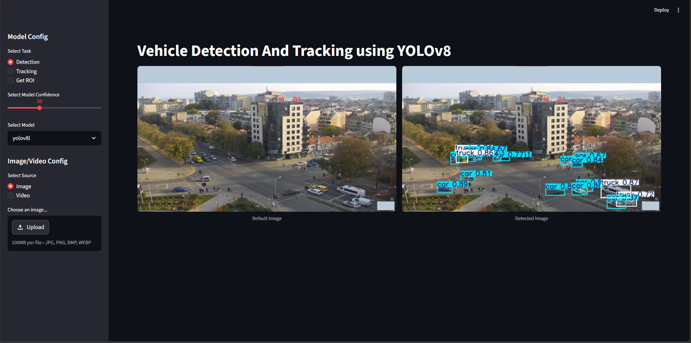
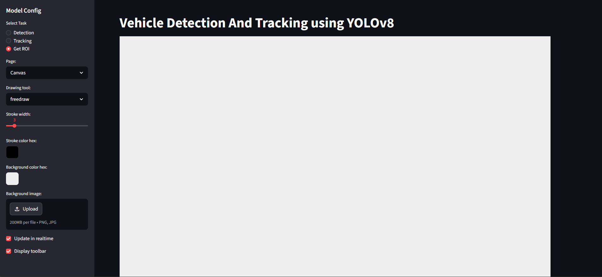

# Traffic Flow Tracking using Object Detection


A computer vision application for **detecting, tracking, and counting vehicles in traffic videos** using **YOLOv8**, **ByteTrack/SORT**, **OpenCV**, and **Streamlit**.

This project was developed as a **graduation thesis** titled **"Traffic Flow Tracking"**. The system focuses on traffic monitoring by detecting vehicle classes, tracking vehicle movements across frames, and counting vehicles inside user-defined Region of Interest (ROI) zones.

---

## Table of Contents

- [1. Project Summary](#1-project-summary)
- [2. Demo](#2-demo)
- [3. Problem Statement](#3-problem-statement)
- [4. Objectives](#4-objectives)
- [5. Key Features](#5-key-features)
- [6. Tech Stack](#6-tech-stack)
- [7. System Workflow](#7-system-workflow)
- [8. Dataset](#8-dataset)
- [9. Model Training](#9-model-training)
- [10. Evaluation Results](#10-evaluation-results)
- [11. Application Screenshots](#11-application-screenshots)
- [12. Project Structure](#12-project-structure)
- [13. Installation](#13-installation)
- [14. How to Run](#14-how-to-run)
- [15. Model Weights](#15-model-weights)
- [16. My Role](#16-my-role)
- [17. Limitations](#17-limitations)
- [18. Future Improvements](#18-future-improvements)
- [19. Thesis Documents](#19-thesis-documents)
- [20. Author](#20-author)

---

## 1. Project Summary

| Item                | Description                                                     |
| ------------------- | --------------------------------------------------------------- |
| Project name        | Traffic Flow Tracking using Object Detection                    |
| Thesis title        | Traffic Flow Tracking                                           |
| Domain              | Computer Vision, Intelligent Transportation System              |
| Main task           | Vehicle detection, vehicle tracking, ROI-based vehicle counting |
| Detection model     | YOLOv8                                                          |
| Tracking algorithms | ByteTrack, SORT                                                 |
| App framework       | Streamlit                                                       |
| Main input          | Image / video                                                   |
| Main output         | Vehicle class, tracking ID, vehicle count, visualized results   |
| Vehicle classes     | Car, Bus, Truck                                                 |

---

## 2. Demo


| Presentation Slides | [View Slides](https://canva.link/8aws9a28cqbrkml) |

### Demo Video

[Watch Demo Video](YOUR_DEMO_VIDEO_LINK_HERE)

### Application Preview





---

## 3. Problem Statement

Urban traffic monitoring is an important task for modern transportation management. Manual vehicle counting is time-consuming, difficult to scale, and not suitable for analyzing long traffic videos or multiple road lanes.

This project aims to build an automated system that can detect, track, and count vehicles from traffic videos. The system provides useful information such as vehicle quantity, vehicle type, tracking ID, and movement behavior, which can support traffic analysis and urban traffic management.

---

## 4. Objectives

The main objectives of this project are:

- Detect vehicles in traffic images and videos.
- Classify vehicles into selected categories: `car`, `bus`, and `truck`.
- Track vehicle movement across video frames.
- Assign tracking IDs to detected vehicles.
- Allow users to define ROI zones for vehicle counting.
- Count vehicles passing through selected traffic zones.
- Build a web application so users can test the model without writing code.
- Compare object tracking methods, especially SORT and ByteTrack.
- Compare multiple YOLOv8 model variants based on accuracy and speed.

---

## 5. Key Features

| Feature               | Description                                               |
| --------------------- | --------------------------------------------------------- |
| Image Detection       | Detect vehicles from uploaded traffic images              |
| Video Detection       | Detect vehicles frame by frame from uploaded videos       |
| Multi-object Tracking | Track vehicles across frames using SORT or ByteTrack      |
| ROI Selection         | Draw custom Region of Interest zones for vehicle counting |
| Vehicle Counting      | Count vehicles when they enter selected ROI zones         |
| Model Selection       | Choose different trained YOLOv8 models                    |
| Confidence Control    | Adjust confidence threshold directly from the app         |
| Streamlit Interface   | Interactive interface for testing and visualization       |

---

## 6. Tech Stack

| Category             | Tools / Libraries         |
| -------------------- | ------------------------- |
| Programming Language | Python                    |
| Object Detection     | YOLOv8, Ultralytics       |
| Object Tracking      | ByteTrack, SORT           |
| Computer Vision      | OpenCV                    |
| Web Application      | Streamlit                 |
| Data Processing      | NumPy, Pandas             |
| ROI Drawing          | Streamlit Drawable Canvas |
| Model Training       | Kaggle, Google Colab      |
| GPU Environment      | NVIDIA Tesla P100, T4     |

---

## 7. System Workflow

The proposed system follows this general pipeline:

```text
Input Video / Image
        |
        v
Frame Extraction
        |
        v
YOLOv8 Object Detection
        |
        v
Vehicle Class Prediction
        |
        v
SORT / ByteTrack Object Tracking
        |
        v
Tracking ID + ROI Processing
        |
        v
Vehicle Counting
        |
        v
Output: Class + ID + Quantity + Visualized Result
```

### Workflow Explanation

1. **Input**  
   The system receives an image or video from the user.

2. **Object Detection**  
   YOLOv8 detects vehicles and returns bounding boxes, confidence scores, and class labels.

3. **Object Tracking**  
   SORT or ByteTrack assigns an ID to each vehicle and tracks it across frames.

4. **ROI Processing**  
   The user defines counting zones using the ROI canvas.

5. **Vehicle Counting**  
   When a tracked vehicle enters the ROI, the system updates the vehicle count.

6. **Output Visualization**  
   The app displays bounding boxes, class names, confidence scores, tracking IDs, and counting results.

---

## 8. Dataset

The dataset was created by extracting frames from traffic videos.

| Item                  | Value                |
| --------------------- | -------------------- |
| Total images          | 5,412 images         |
| Frame extraction rate | 10 frames per second |
| Image size            | 640 x 360 pixels     |
| Classes               | Car, Bus, Truck      |

### Data Split

| Dataset Split | Number of Images |
| ------------- | ---------------: |
| Train         |            4,729 |
| Validation    |              456 |
| Test          |              227 |
| Total         |            5,412 |

---

## 9. Model Training

### Training Environment

| Environment         | Specification              |
| ------------------- | -------------------------- |
| Kaggle GPU          | NVIDIA Tesla P100 and T4   |
| Kaggle RAM          | 13 GB                      |
| Evaluation platform | Google Colab               |
| Colab CPU           | Intel Xeon 2.20GHz         |
| Colab GPU           | NVIDIA Tesla T4, 15102 MiB |

### Training Configuration

| Parameter       | Value                        |
| --------------- | ---------------------------- |
| Model family    | YOLOv8                       |
| Epochs          | 30                           |
| Image size      | 640 x 360 pixels             |
| Dataset size    | 5,412 images                 |
| Hyperparameters | Default Ultralytics settings |

---

## 10. Evaluation Results

### 10.1 YOLOv8 Model Comparison

| Model   | Size | mAP50 | mAP50-95 | CPU PyTorch Speed (ms) | CPU ONNX Speed (ms) | GPU TensorRT Speed (ms) | Params (M) | FLOPs (B) |
| ------- | ---: | ----: | -------: | ---------------------: | ------------------: | ----------------------: | ---------: | --------: |
| YOLOv8n |  640 |  93.8 |     77.9 |                 164.76 |               635.2 |                    7.98 |       3.01 |      4.10 |
| YOLOv8s |  640 |  93.7 |     79.3 |                  445.6 |               627.9 |                    8.28 |       11.4 |     14.33 |
| YOLOv8m |  640 |  93.8 |     80.4 |                 1103.6 |              1579.2 |                   17.42 |      25.86 |     39.54 |
| YOLOv8l |  640 |  93.6 |     79.9 |                 2096.7 |              2801.7 |                   33.58 |      43.63 |     82.71 |
| YOLOv8x |  640 |  94.0 |     79.3 |                 2921.4 |              2801.7 |                    53.5 |      68.16 |    129.07 |

### Key Observation

- YOLOv8x achieved the highest `mAP50`.
- YOLOv8m achieved the highest `mAP50-95`.
- YOLOv8n was the most lightweight and fastest option.
- For practical deployment, model selection should balance accuracy, speed, and hardware resources.

---

### 10.2 SORT vs ByteTrack Comparison

| Metric               |    SORT | ByteTrack |
| -------------------- | ------: | --------: |
| MOTA                 |   54.7% |     77.3% |
| MOTP                 |   77.5% |     82.6% |
| ID Switches          |     831 |       558 |
| Mostly Tracked (MT)  |   34.2% |     54.7% |
| Mostly Lost (ML)     |   24.6% |     14.9% |
| False Positives (FP) |   7,876 |     3,828 |
| False Negatives (FN) |  26,452 |    14,661 |
| Processing Speed     | 143 FPS |   171 FPS |

### Key Observation

ByteTrack performed better than SORT in most tracking metrics. It had higher MOTA and MOTP, fewer ID switches, fewer false positives, fewer false negatives, and higher processing speed in the tested open-access video dataset.

---

## 11. Application Screenshots

### 11.1 Vehicle Detection

The detection page allows users to choose the model, adjust confidence threshold, upload an image, and view the detected result.


### 11.2 ROI Drawing

The ROI page allows users to draw custom counting zones directly on the interface.


---

## 12. Project Structure

Recommended repository structure:

```text
Traffic-Flow-Tracking-using-Object-Detection/
│
├── README.md
├── requirements.txt
├── .gitignore
├── app.py
├── helper.py
├── settings.py
├── zone.py
│
├── assets/
│   ├── detection-demo.png
│   ├── roi-canvas.png
│   ├── tracking-demo.png
│   └── demo.gif
│
├── docs/
│   ├── thesis-report.pdf
│   └── presentation-slides.pdf
│
├── sample_data/
│   ├── images/
│   │   └── sample_traffic.jpg
│   └── videos/
│       └── sample_traffic.mp4
│
├── weights/
│   ├── trained_SR_DSrc_yolov8n.pt
│   ├── trained_SR_DSrc_yolov8s.pt
│   ├── trained_SR_DSrc_yolov8m.pt
│   ├── trained_SR_DSrc_yolov8l.pt
│   └── trained_SR_DSrc_yolov8x.pt
│
├── ByteTrack/
├── SORT/
├── images/
├── img/
└── src/
```

> Note: If model files or sample videos are too large, store them on Google Drive and provide download links in this README.

---

## 13. Installation

### 13.1 Clone Repository

```bash
git clone https://github.com/mnhtan/Traffic-Flow-Tracking-using-Object-Detection.git
cd Traffic-Flow-Tracking-using-Object-Detection
```

### 13.2 Create Virtual Environment

```bash
python -m venv venv
```

Activate the virtual environment:

```bash
# Windows
venv\Scripts\activate
```

```bash
# macOS / Linux
source venv/bin/activate
```

### 13.3 Install Dependencies

```bash
pip install -r requirements.txt
```

If `cython-bbox` causes an installation error, install it manually:

```bash
pip install cython-bbox
```

---

## 14. How to Run

Run the Streamlit app:

```bash
streamlit run app.py
```

Then open the local URL shown in the terminal.

### App Usage

1. Select task:
   - `Detection`
   - `Tracking`
   - `Get ROI`

2. Select model confidence threshold.

3. Select YOLOv8 model.

4. Select input source:
   - Image
   - Video

5. Upload image or video.

6. View detection/tracking/counting result.

7. Use `Get ROI` mode to draw counting zones if needed.

---

## 15. Model Weights

The trained YOLOv8 model weights are not included in this repository if they exceed GitHub file size limits.

Download model weights here:

```text
YOUR_MODEL_WEIGHT_LINK_HERE
```

Then place the `.pt` files in:

```text
weights/
```

Expected format:

```text
weights/
├── trained_SR_DSrc_yolov8n.pt
├── trained_SR_DSrc_yolov8s.pt
├── trained_SR_DSrc_yolov8m.pt
├── trained_SR_DSrc_yolov8l.pt
└── trained_SR_DSrc_yolov8x.pt
```

---

## 16. My Role

As one of the developers of this graduation thesis project, I contributed to:

- Researching object detection and multi-object tracking methods.
- Preparing traffic image data from video sources.
- Training and evaluating YOLOv8 models.
- Comparing SORT and ByteTrack for vehicle tracking.
- Designing ROI-based vehicle counting logic.
- Building the Streamlit application interface.
- Testing the system with image and video inputs.
- Preparing the thesis report and presentation materials.

---

## 17. Limitations

Some current limitations of this project:

- Model performance may decrease in crowded traffic scenes.
- Occlusion between vehicles can cause tracking ID switches.
- Low-light or bad weather conditions may affect detection accuracy.
- ROI counting accuracy depends on how the user draws the counting zone.
- The system has not yet been fully tested in real-time production environments.
- The current version mainly focuses on cars, buses, and trucks.

---

## 18. Future Improvements

Potential improvements:

- Add real-time webcam or RTSP camera support.
- Improve tracking stability in crowded scenes.
- Add vehicle speed estimation.
- Add direction-based counting by lane.
- Export counting results to CSV or Excel.
- Create a dashboard for traffic statistics.
- Deploy the app online using Streamlit Community Cloud or another cloud platform.
- Expand vehicle classes, such as motorcycle, bicycle, and pedestrian.
- Improve model performance under low-light and rainy conditions.

---

## 19. Thesis Documents

This project was developed as a graduation thesis.

| Document            | Link                                        |
| ------------------- | ------------------------------------------- |
| Thesis Report       | [View Report](docs/thesis-report.pdf)       |
| Presentation Slides | [View Slides](docs/presentation-slides.pdf) |
| Demo Video          | [Watch Demo](YOUR_DEMO_VIDEO_LINK_HERE)     |

---

## 20. Author

**Phan Minh Tan**

- GitHub: [mnhtan](https://github.com/mnhtan)
- LinkedIn: [YOUR_LINKEDIN_LINK_HERE]
- Email: YOUR_EMAIL_HERE

---

## Acknowledgements

This project was completed as part of a graduation thesis at the Faculty of Information Technology, Ho Chi Minh City University of Foreign Languages and Information Technology.

Special thanks to the thesis supervisor and open-source computer vision communities for supporting the research and development process.
